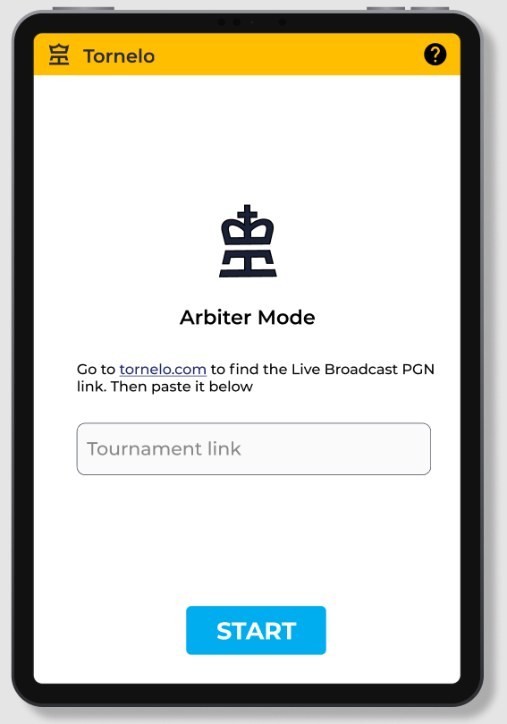
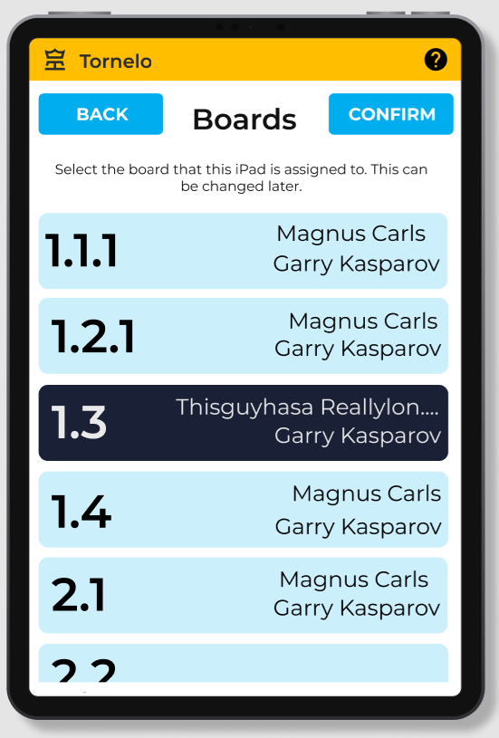
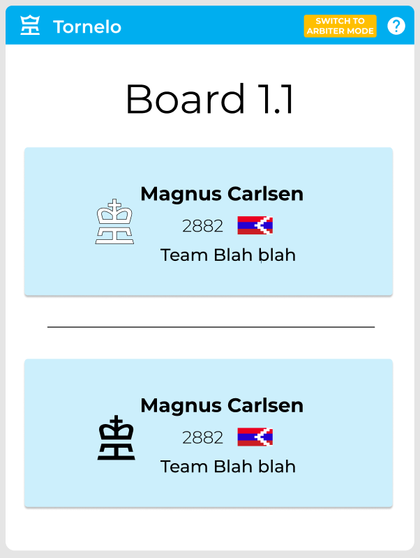
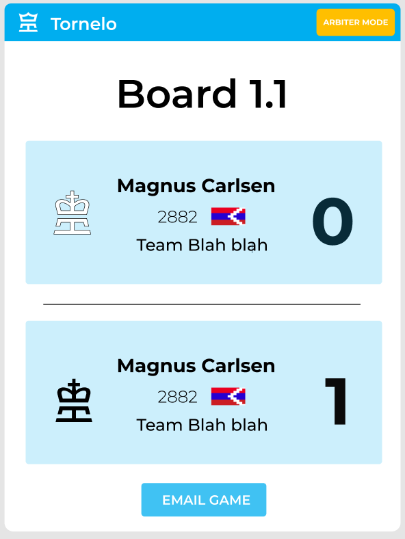

# System Design Documentation
###### Tornelo Chess Scoresheet App

## Overview of Design Considerations
The two main forms of design that are most relevant to the Tornelo Scoresheet app project are the System Architecture and the User Interface Design.

**System Architecture**

The System Architecture includes the way the model, the way the program is structured and the programming languages and tools used.

Key areas of this aspect of the system design and rationale behind relevant design choices are documented in Section 1 of this document.

**User Interface (UI) Design**

The User Interface Design is a holistic approach to deciding how the applications functional elements are displayed on the screen. This includes considering the users and their experiences, as well as the necessary features and functional requirements.

Key areas of this aspect of the system design and rationale behind relevant design choices are documented in Section 1 of this document.

## 1 System Architecture

### 1.1 Choice of Software

#### Swift
- Because the client is only intrested in creating an iOS application, an obvious candidate framework would be swift.
  - Advantages
    - native to iOS
    - Rapid development
  - Disadvantages
    - Requires compilation in mac environment
    - Team is unfamiliar with swift
    - Poor tooling in windows
- Since not all members of the team are working on macs, swift programming was determined to not be the best solution.

#### React Native
- React native is a popular framework for developping cross platform apps, it is compatible with windows and has a wide support base.
  - Advantages
    - Team is familiar with react
    - Ability to use Typescript, which the team has used extensively in the past
    - Live reloading
  - Disadvantages
    - Difficult to debug
- Due to the team's familiarity with React, React native is an obvious choice for our app

#### Flutter
- Flutter is a cross platform app development framework by Google written in Dart.
  - Advantages
    - Growing popularity
    - Strong community
  - Disadvantages
    - Team is unfamiliar with Dart language
    - Limited tools and libraries
    - Large file sizes and slow build times
- Given the team is unfamiliar with the Dart language, Flutter is not the best solution however it remains as a strong candidate

#### Xamarin
- Xanarin is a Microsoft framework for developping cross plarform apps, it is compatible with windows and is written in C#.
  - Advantages
    - Cross platform development
    - Many free packages available
  - Disadvantages
    - Poor tooling availability in mac environments
    - Team is unfamiliar with C#
    - Proprietary
- Due to some of the team's unfamiliarity with C# and the poor tooling available on macs, we will not opt for a Xamarin solution

### 1.2 Library Usage
The use of libraries is recommended for this project, and approved by the Product Owner.

**Justification**

The main benefit of using existing code libraries is to save time on the project. A big priority is to get the application approved by the International Chess Federation (FIDA) as soon as possible, so saving time is a priority.

Furthermore, existing solutions in many cases might be more optimised than we could make from scratch with current resources. For example, there is no need to reinvent the wheel and code a chess engine when hundreds of such libraries are freely available, and are likely more optimised

Therefore, the use and adaptation of libraries is strongly encouraged where possible.

**Libraries Used**

Currently, the following libraries have been investigated and are being used as part of the system architecture:

- **chess.ts**: A chess library and rewrite of chess.js in Typescript that is used for chess move generation/validation, piece placement/movement, and check/checkmate/stalemate detection.

### 1.3 Paradigm and Architecture
#### Paradigm - Functional
Our team has decided that a `Functional` paradigm most suited for the project. A functional paradigm means that code artefacts use functions extensively and prioritise composition over inheritence. The advantages of using functional are as follows:
- Allows the use of React's powerful features such as `Hooks` an `Functional Components`.
- Easier to debug, because functional programming focuses on **what** code components do instead of **how** they do it.
- Allows for cleaner global state management (see below)

#### Architecture
Glossary:
| Name | Description |
| ---- | ----------- |
| Component | Independent and reusable bits of code, predominantly the view |
| Prop | Arguments or parameters used in the creation of a component |
| Context | A global "store" for data to be shared between components |
| Hook | Allows function components to access/modify state |
| View | Part of code that is responsible for displaying things on screen, or interfacing with other parts of code (like APIs) |
| Type | Metadata or a description of how the compiler sees the value |

- Global state management
  - Context Providers and Hooks
  - What is a hook
  - what is a context
  - Advantages over components and props
- Components, Pages, and Hooks
  - Explain app has distinct functionalities, distinct pages with limited sharing of business logic.
  - Explain component reusability
  - View: Components & Pages
  - ViewModel: Hooks

## 2 User Interface (UI) Design
The Tornelo Scoresheet iOS app is primarily a front-end solution for recording chess game data. Due to this, the User Interface (UI) and the User Experience (UX) for this app is extremely important.

### 2.1 UI/UX Design Methodology
The following methodology is used to develop the user Interface design for this project in a holistic way to ensure a rigorous, functional and usable design.

**Understand the target users, their needs and usability requirements.**
- The target users need to be kept front of mind to understand the kind of user interface and user experience that needs to be designed.
- The users are explored in Section 2.2, as well as the usability implications.

**Consider the scope and necessary features.**
- The functionality of the app is brainstormed during the UI Design process, to ensure the product can perform all of the necessary functions.
- The key features that need to be included in the design are detailed in Section 2.3.

**Establish the functional requirements and limitations.**
- There are a range of fine-grain functional requirements that impact the user interface.
- In particular, a heavy proportion of the UI is dictated by the International Chess Federation (FIDE) rules and regulations for digital scoresheets.
- Other requirements are also added by the Product Owner.
- Key requirements which impact the interface design are summarised in Section 2.4.

**Iterate on wireframes with incremental feedback.**
- After properly understanding the users, features and requirements, the wireframes are designed using the tool Figma.
- The designs are iterated with the product owner’s feedback until all design requirements are fulfilled.
- The current wireframes and the justifications for various design decisions are detailed in Section 2.5.

It’s essential to note that the user interface design process is iterative. Understanding of the user personas, features and requirements are developed and clarified in feedback cycles with the Product Owner and other resources.

Furthermore, the wireframes are designed together as a team in iterations. This involves meeting with the Product Owner to review the design and gather feedback before improving the design further.

This iterative process ensures that no requirements are missed or forgotten, and leads to an optimal design that meets everyone's needs.

### 2.2 User Experience
In order to develop a good UI design with a positive User Experience, it’s essential to consider the target user personas, and their usability requirements.

There are two key users for the Tornelo Scoresheet app - a tournament Arbiter and a Player.

#### User Persona: The Arbiter
###### Who are they?

The arbiter is an adult that is the organiser of the tournament, responsible for managing and scoring the chess games. They are likely very busy due to keeping a lot of moving parts in the competition under control, with lots of people and games to take care of at a time.

######  What are their main goals?
- Ensure tables & boards are set up and ready at each stage of a tournament.
- Make sure tournament pairings are completed & correct
- Serve the needs/wants of players

######  What are their main concerns?
- Ensuring that the players aren’t using the iPads for cheating

#### User Persona: The Player
######  Who are they?

The player is a person participating in the chess tournament. They could be any age, ranging from a young kid to a much older person who is less familiar with technology. The player might be stressed or anxious due to being involved in a competition with real stakes, and want to be able to focus on the chess game to ensure they perform as well as they can.

###### What are their main goals?
- To be able to easily record their moves while remaining focused on the game.
- Be confident that the opponent isn’t cheating.

###### What are their main concerns?
- That entering the chess moves via iPad is unfamiliar, difficult and as a result time consuming and distracting.

#### Usability Requirements
With these user personas in mind, the following set of usability requirements follow. The design needed to abide by these guidelines  to ensure a positive user experience. The UI must:
- Be clear and easy to navigate, even for someone young or less familiar with technology,
- Be intuitive, so that users are able to perform tasks in a minimal amount of time,
- Cater to visually impaired users so as to not disadvantage them during a tournament,
- Have large and well-labelled UI elements and buttons that are easy to find, understand the purpose of, and use.

### 2.3 Scope and Features
The high-level features of the Tornelo Scoresheet app are listed in the table below. They form the basis of the purpose and functionality of the app, and hence play a large role in the UI Design process.

| Feature | Justification |
| ---- | ---- |
| Enter a live broadcast PGN link in Arbiter mode. | The app requires access to game data on Tornelo server for the tournament Arbiter to set up the game data collection. At MVP level, this is simply done via a manually-entered PGN Broadcast link. (In future iterations this feature will be superseded by directly fetching data from Tornelo server using websockets). |
| Enter Table Pairing Mode and select a board from available games in the round. | During the set up of a tournament, each device would get assigned to a separate table. The Table Pairing Mode is a way for the tournament Arbiter to choose to which game each device is assigned. |
| Enter Game Mode, where certain actions are blocked. | Due to strict requirements of FIDE, for the app to be approved for use in official chess tournaments, the Game Mode needs to prevent the user from taking actions (like leaving the app, going out of Game Mode, etc) |
| Enter moves, times and actions during Game Mode. | The chess player should be able to use the app to record their chess moves, for both players, according to the owner specifications. This is a key feature of the app (as a replacement to paper scoresheets).
| Review and edit previous moves during Game Mode. | In case the player has entered a mistake, they are able to go back into their previously entered moves and update them. |
| End Game Mode and review the results. | The Arbiter and Player should be able to review their submission. (Post-MVP, the Ariber should also be able to perform scoresheet reconciliation tasks to corroborate the two chess player’s recorded moves). |

### 2.4 Functional Requirements
In addition to the high-level features of the app, it’s essential to consider a range of more fine-grained requirements which dictate certain aspects of the user interface.

Since the Tornelo Scoresheet app is intended for use in official chess competitions, the majority of these functional requirements are set by the International Chess Federation (FIDE). FIDE provides a requirement document (Electronic Scoresheet standards: https://handbook.fide.com/files/handbook/C02Standards.pdf) which outlines the functions that an application needs to meet in order to be approved for use. The key requirements which impact the user interface design are summarised here.

**Key FIDE Requirements**
- During Game Mode, it is not possible to switch to any other mode (on purpose or by accident), unless authorised by Arbiter. Only the arbiter iis allowed to enter Arbiter mode during a game.
- The current mode / state of the app (ie. Arbiter Mode, Table Pairing Mode, Game Mode) are really clearly visible to anyone who can see the screen.
- The game notation is clearly visible for the arbiter, with a minimum of 7 moves always visible on the screen at any time.
- A game finishes when a result is noted and both players sign the score sheet.
- The device must be able to restart the notation.
- It must be possible to enter: illegal moves (including playing past checkmate), enter clock times, draw offers, and to enter a dash instead of a move.
- An automatic move counter should be available.
- It is not allowed to correct or signalling illegal moves automatically.
- If the battery has low power this must be clearly signalled.

In addition to these requirements, the following requirements are also agreed upon with the Product Owner which will impact the User Interface Design.

**Additional Product Owner requirements**
- The device used will be an iOS iPad Mini (height of 195.4 mm, width of 134.8 mm).
- The app should not be used in landscape mode (due to space limitations at chess tournament venus).
- Users should have the option to enter moves in two ways. It should be easy to switch between these two move entry methods. The methods are:
-- By using a chess board view by moving figurines, or
-- By using a digital scoresheet notation.
- Chess terminology needs to be used throughout the app correctly, including full algebraic chess notation for displaying the move list (which can be quite a lot of characters per move).
- The Tornelo branding needs to be used throughout the app, including the brand colours, logos and figuring icons.

These requirements create a lot of constraints on the application UI design. A major part of the design process involves ensuring all of the functional requirements are fulfilled, while still considering the functionality and user experience.

### 2.5 Wireframes
The wireframes are designed using the tool Figma (www.figma.com) as recommended by the Product Owner.

The full design can be located at: https://www.figma.com/file/MSItAKHLGvKxveIIRSh1tp/Tornelo-Scoresheet?node-id=0%3A1

According to the features and functional requirements, the application is broken down into the following 7 pages:
- **Landing Page**: The landing page is the first page the user sees when they open the application.
- **Arbiter Mode: PGN Entry**: On this page, the Arbiter enters the PGN Broadcast link to fetch the relevant game matching data from the Tornelo server.
- **Arbiter Mode: Board Selection**: In this page, the Arbiter selects the match that will be recorded on this device.
- **Table Pairing Mode**: This page is displayed after the device is assigned to the table. It displays the players who will be playing at this board, and is used by players to locate their table, and potentially also for the audience to familiarise themselves with who is playing.
- **Game Mode: Graphic Recording**: In this mode, the user will enter moves and times using the graphical chess interface.
- **Game Mode: Textual Recording**: In this mode, the user will enter moves and times using the textual interface.
- **Results Screen**: This is the screen that displays the results after a game is completed.

The current UI design and rationale for key design decisions for each page are as follows.

| Current Design | Design Rationale |
| ----- | ----- |
| | 
<strong>Landing Page</strong>
 <ul><li>Arbiter mode is clearly signified with the blue banner, and Tornelo branding is visible. </li><li>A scrollable list is available (scroll bar necessary for easy navigation as there can be hundreds of boards listed). </li><li>The text is large and accessible for the Arbiter to quickly read.</li><li>The board cells are large and easily selectable, with a large surface area to tap on for increased usability. </li><li>The names for players with long names will be truncated to fit onto the cell. </li></ul> |
|   | 
<strong>Arbiter Mode: PGN Entry</strong>
 <ul><li>The Blue banner at the top of the screen signifies Arbiter Mode (as required by the functional requirements - the app mode should be easily visible). </li><li>The Arbiter will use this mode, so the design is simple, minimalistic and has clear instructions to accommodate a busy arbiter with lots of devices to set up.</li><li>Tornello branding and colours are used.</li></ul> |
|   | 
<strong>Arbiter Mode: Board Selection</strong>
 <ul><li>Arbiter mode is clearly signified with the blue banner, and Tornelo branding is visible.</li><li>A scrollable list is available (scroll bar necessary for easy navigation as there can be hundreds of boards listed). </li><li>The text is large and accessible for the Arbiter to quickly read. </li><li>The board cells are large and easily selectable, with a large surface area to tap on for increased usability. </li><li>The names for players with long names will be truncated to fit onto the cell.</li></ul> |
|   | 
<strong>Table Pairing Mode</strong>
 <ul><li>Tornello branding, icons and colours are used</li><li>The text is large and easy to read for someone walking past the table. </li><li>Facts about the users are displayed such as their country, raking etc. for the audience. </li><li>It is very clear to the user which player is black and which player is white so that when they locate their table, they can easily understand where to sit.</li></ul> |
|   | 
<strong>Game Mode: Graphic Recording</strong>
 <ul><li>The game mode is clearly displayed.</li><li>The users playing are clearly displayed.</li><li>All of the functional buttons are displayed as per the functionality requirements. They are also labelled with text to ensure their functions are clear to the players.</li><li>The scrollable move list at the bottom meets the requirement to display a minimum of 7 moves at a time. </li><li>The option to switch into Arbiter Mode is presented, and also the option to switch to Scoresheet Entry mode. </li></ul> |
|   | 
<strong>Game Mode: Textual Recording</strong>
 <ul><li>The game mode is clearly displayed.</li><li>The screen is designed to mimic the familiar paper scoresheet that players are accustomed to.</li><li>The move list meets the requirement to display a minimum of 7 moves at a time.</li><li>A large font size is used for usability, and the longest chess move in long algebraic notation can fit onto the screen. </li><li>All of the functional buttons are displayed as per the functionality requirements. They are also labelled with text to ensure their functions are clear to the players.</li></ul> |
|  | 
<strong>Results Screen</strong>
 <ul><li>The score is very large and clearly visible to audience members or anyone walking by. </li><li>The Tornelo colours and branding is clearly visible. </li></ul> |
