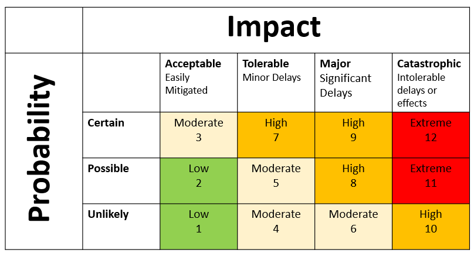

# Introduction
## Risk Management involves four major phases: 

**Risk Identification:** Identify risks that may affect the project outcome.  

**Risk Analysis:** Prioritize risks for subsequent ongoing management based on their likelihood of occurrence and degree of potential impact.  

**Risk Response Planning:** Develop appropriate options and action plans to reduce the threats of specific risks.   

**Risk Monitoring and Control:** Identifying, analyzing, and planning for newly identified risks, monitoring previously identified risks, and reevaluating existing risks to verify the planned risks response strategies for their effectiveness.  

# Risk Rating Matrix 

## Team Risks

### Moving Online								
### Rating: 1
In response to an outbreak of COVID-19 in Victoria, it is possible that Monash returns an online format. This means that all activities and communication will have to be done from home. This could lead to a decrease in output, and difficulties in communication, which can create a risk of not meeting deadlines, or miscommunication/lack of communication occurring.  

**MONITORING:** Await news from the University and keep up to date with announcements from the Premier. For communication and workload monitoring refer to sections below on “Sub-optimal individual contributions”, “Teams have difficulty arranging consistent meetings” and “Insufficient communication from individuals”.

**CONTINGENCY:** In-person meetings will be replaced with Zoom meetings. There will be a greater emphasis on presence and participation in the communication channels - specifically Facebook Messenger which project members should check regularly.

### Group Member in Quarantine				
### Rating: 2
If the team is operating on campus and a member of the group must quarantine/self-isolate and will have to work from home. This will impact the team’s ability to communicate face-to-face and may incur delays from communication barriers. It may also result in other team members being close contacts and having to isolate. If the team is operating in online mode, then this situation still needs to be considered, as we must consider the personal stresses involved with a long term of isolation.

**MONITORING:** Any team member who is required to isolate should inform the others in a timely manner. Check up on members in quarantine, discuss their situation and whether they believe they may need a decreased workload. 

**MITIGATION:** Review assigned workloads to ensure they remain realistic and flexible. The team member(s) in quarantine will decide their potential to contribute to the team. If they can continue contributing, they may be assigned a reduced workload to accommodate their situation. As the team is based entirely on campus, the team will incorporate the affected team member into all in-person sessions via Zoom.

### Loss of a Group Member (Temporary)			
### Rating: 5
If a group member is temporarily unavailable to contribute to the team, or their capacity to contribute is significantly reduced, the team may not be able to complete the work allocated to the sprint. This may slow down the project's planned progression.

**MONITORING:**
Team members should be active on the group chat at least every couple of days, and alert the rest of the team if they are unable to complete work in the sprint.
Unexplained absences should be recorded in meeting minutes.

**MITIGATION:**
Effective mitigation requires teams to ensure that there is no work which can only be readily performed by a single team member. Allowing for a certain amount of ‘slack’ or unallocated time in each increment could allow a temporary loss to be accommodated with minimal disruption. Proper use of the Trello board to precisely record each member's current pending tasks will reduce the time spent on coordinating the schedule recovery effort.

**CONTINGENCY:**
The team members currently assigned tasks must be re-assigned. Until the team member is able to return, their continued absence must be factored in all planning decisions.

### Loss of a Group Member (Permanent)			
### Rating: 8
If a group member discontinues the unit, or is otherwise permanently no longer part of the project there will be a decrease in the number of project members. This may slow down the project's planned progression.

**MONITORING:** Continuous communication and check-ins with team members so that it can be addressed as early as possible. 

**MITIGATION:** Ensure team members are cross-functional so that tasks can be re-assigned and ensure that work is pushed regularly. During planning and task assignment ensure that no member is doing so much that there is no chance of it being completed without said person. 

**CONTINGENCY:** Re-assign tasks but ensure that the redistributed tasks will not burn the remaining team out. Contact all parties expecting the tasks to be delivered and negotiate the expected due date, and inform all parties within the project that may be relying/dependent on your features. Take into account the smaller team size when planning future sprints.

### Team Members Fail to Agree on a Design Choice	
### Rating: 4
Increased conflict within the team. Decreased likelihood of future input on design decisions.

**MONITORING:** Teams should have regular meetings to discuss design updates and changes. These meetings can be used to identify any areas where team members disagree. 

**MITIGATION:** Ensure that all team members have the opportunity to not just describe their choice, but to justify it and contrast it to the alternative suggestions.  Ensure that all communication is done in a professional manner. 

**CONTINGENCY:** All members of the team will get an input on how to resolve design choice disputes. The option with the most support will be the one selected.

### Sub-Optimal Individual Contributions 			
### Rating: 4
The end product may be less usable, stable, complete or some combination of these three issues.

**MONITORING:** The contributions of all team members should be reviewed by another team member.

**MITIGATION:** Team members should follow internal guidelines from the CONTRIBUTING.md document when writing code. If needed, a meeting can be organised to discuss areas of potential improvement. Testing should be done as often as possible to ensure that code functions as expected.

**CONTINGENCY:** Team members should raise their concerns about the quality of work privately. This should be done as early as possible and should clearly identify any shortcomings. The team member may be asked if they would be interested in further support, such as discussing relevant documentation with a more experienced team member or working in a pair-programming type arrangement for a period of time. If possible, the team member could be re-assigned to contribute to an area of responsibility which is distinct from their current role. An example of this could be moving from an active development role to producing documentation or test cases.

### The Team has Difficulty Arranging Consistent Meetings		
### Rating: 2
The project schedule may be impacted due to decreased opportunities for clarification, planning and consultation.

**MONITORING:** Team members should fill out the [when to meet](https://www.when2meet.com/?15004262-EVcdL) and ensure it is up to date with their general availability. Meetings will be arranged via the messenger chat so team members should check this daily. The weekly lab will act as an established meeting time. If an 
extra meeting is needed, it will be organised at the time that suits the most people. 

**MITIGATION** Determine the appropriate meeting durations and frequencies. If no time and duration is perfect for the team, encourage a majority of the team to meet when possible. Communicate to the remaining team members clear expectations for how they can contribute and keep the team informed. Detailed minutes should be taken at all meetings and read by team members who are unable to attend.

### Insufficient Communication From Individuals	
### Rating: 5
A member of the team is not present/responding on communication channels in a timely manner, and reasons for this have not been provided to the rest of the team in advance. The impact this will have on the project increases with the duration of no contact and must be accounted for when devising monitoring and mitigation strategies.

**MONITORING:** Team members are to ensure that if they are expecting to be unable to stay in contact with the team, they inform their team-mates. For unexpected absences it is the responsibility of the rest of the team to try and chase up said member. 

**MITIGATION:** If a week has passed with no communicated from the team member, the remaining team is to assume a temporary loss of a group member, see mitigation for “Loss of group member (temporary)” outlined previously. If this persists beyond two weeks, the team is to assume permanent loss of a group member, see mitigation and contingency for “Loss of group member (permanent)”.

**CONTINGENCY:** After exhausting all communication options, the team will re-assign all the team members pending tasks. Future plans will be made under the assumption that the team member will continue to be absent. If the team member is failing to contribute regularly, it should be raised with the team’s supervisor.

### Implementation Difficulties					
### Rating: 8
Difficulties experienced whilst implementing features may negatively impact both the project schedule as well as product quality.

**MONITORING:** Unexpected delays in work or incomplete work should be communicated in the Messenger group.

**MITIGATION:** The person struggling should reach out to the rest of the team if they are encoutering difficulties. To minimise repeated incidents, any resolved issues which may be relevant to other teams should be recorded in a central location (e.g on GitHub or Slack) 

**CONTINGENCY:** If needed, another team member can join the ticket to help complete the work. If no member of the team is able to assist, the work may need to be pushed to the next sprint. 

### Large Knowledge/Experience Gap Between Members												
### Rating: 4
A continued skill disparity between team mates may lead to unbalanced workloads and an undue dependence on individual team members. This will impact the ability of the team to meet objectives in the event of illness or burnout. 

**MONITORING:** At the beginning of the project, team members should share their strengths and weaknesses. This can be done as often as is needed throughout the project as new technologies are used.

**MITIGATION:** Members who have less app development experience should partner code with more experienced team member for the first sprint. They should then attemp to implement functionality on their own using the existing code as a guideline. Code reviews will be done to ensure consistent quality. If a team member is required to use a particular technology before the rest of their team, they will be encouraged to keep record of any particularly helpful spikes or resources.

**CONTINGENCY:** If a knowledge gap is persistent and it impacts scheduling or work distribution, team members will share their concerns with their team. Project scheduling may temporarily be adjusted to allow for any unbalanced pairs to work closely together. This pairing will serve as an intensive instruction program intended to close the gap as quickly as possible. If the gap persists after such an arrangement, the possibility of assigning the team member different tasks may be investigated.

## Client Risks

### Objectives Are Not Met 			           	
### Rating: 10
Client confidence and satisfaction may be diminished. Decreased likelihood of meeting subsequent goals.

**MONITORING:** Ensure that progress is regularly reported and recorded through fortnightly meetings with the client. The client and the team should be on the same page about any upcoming milestones or deliverables. 

**MITIGATION:** Initially plan for a conservative work output per sprint. Gradually adjust this as team capabilities are determined more precisely. If it seems like an objective may not be met, the team should promptly communicate this with the client and discuss alternative strategies. 

**CONTINGENCY**: Determine how close the team came to realising their objectives. Re-evaluate the feasibility of both the missed and any future objectives. The team will decide whether to reduce the expected work output in subsequent increments or request additional resources from other teams.

### The Client Insists on a Late Change in Requirements or Functionality								
### Rating: 8
The team would have to spend time removing and replacing completed work. The impact on the product schedule may be immense.

**MONITORING:** There should be regular communication with the client to show progress and discuss any changes they may want to make. This will involve fortnightly meetings along with more regular email communication.

**MITIGATION:** Clarify client requirements and expectations to the greatest extent possible. Demonstrate work to clients as frequently as is practical to validate the inferred requirements and the related design choices.

**CONTINGENCY:** Have a discussion with the client to determine their priorities and assess the remaining workload to decide whether it is feasible to implement the new functionality. It may come at the expense of being unable to deliver a different requirement. If it is possible to complete the new requirement within the time constraints, the project backlog should be updated to include the new work.

### Client Unhappy With The Quality of Work            
### Rating: 10
The client expressess unhappiness with the quality of work produced by the team.

**MONITORING:** The team should demonstrate the state of the app at the end of each sprint and seek client feedback. 

**MITIGATION:** Code reviews will be done on all pull requests to ensure that the code base is of high quality. The CONTRIBUTING.md document will be used to document software standards. 

**CONTINGENCY:** If the client is unhappy with the app, the team should schedule a meeting to discuss what changes need to be made and update the project backlog accordingly. 

### Lack of Client Communication      
### Rating: 10
If the client fails to communicate with the team it will be difficult for the team to identify client priorities and it increases the probability of the client requesting last minute changes to the app. 

**MONITORING:** The team should organise a meeting with the client every fortnight. If the client failes to respond to email communication for over a week, the project supervisor should be contacted.

**MITIGATION:** The team should have regular communication with the client regarding their priorities and expectations. There should be a clearly defined project timeline.

**CONTINGENCY:** If the client fails to communicate, the team should implement the app based on their understanding of the client's priorities. Regular attemps at communication should be made and the supervisor should be made aware of the sitation and updated on the actions taken by the team. If the issue continues for two weeks, the unit coordinator should be contacted. 

### Failing to Meet Client Functionality Expectations 
### Rating: 8

**MONITORING:** Meetings and product demonstrations with the client at the end of every sprint will allow for monitoring client expectations.

**MITIGATION:** After the initial functionality requirements have been gleaned from the client, they should be converted to user stories as quickly as possible. From these stories, mockups of client-facing functionality should be created and presented to the client for feedback. This feedback will be used to re-shape the stories and mockups in a cycle which ends when the client is either satisfied or unavailable.

**CONTINGENCY:** The nature of the deficiency should be identified to the greatest extent allowed by the client. Several alternatives should be prepared or described as quickly as possible and presented to the client. The project managers will alter the roadmap to prioritise the implementation of features the client deems to be the most important.
The circumstances which lead to the misunderstanding should be identified during the team retro to reduce the likelihood of recurrence. This will be done by identifying what did not go well and possible ways to improve.

### MVP is not completed in time
### Rating: 8

**MONITORING:** The team should monitor their velocity during each sprint to determine if the requirements of the mvp will be met. 

**MITIGATION:** The team should ensure that the project is kept within scope and that as requirements evolve the scope remains feasible. 

**CONTINGENCY:** If the team is unable to complete the MVP before the end of the year they should notify the client and work with them to prioritise the remaining workload. When the project handover occurs, the team should specify which sections of the MVP have not been met.

### International Chess Federation Requests Large Changes   
### Rating: 11
If the International Chess Federation (FIDE) requests large changes to the app, it is unlikely that the team will have time to implement them.

**MONITORING:** The client has been in communication with FIDE to discuss approval for the app, and they will be shown an early version. 

**MITIGATION:** Care should be taken to ensure all FIDE guidelines are met before the app is sunmitted for approval

**CONTINGENCY:** The team will work with the client to proritise what work needs to be done. The team will complete as much as possible before the end of the year. Comprehensive handover documentation should be created to ensure Tornelo developers can continue work if needed.

## Technical Risks

### A Planned Feature is not Achievable Due to an Unforeseen Technical Limitation							
### Rating: 10
Project may fail to meet its current objectives. Delays may have a cascading effect into future program intervals. Ths will be catastrophic if the feature is needed for FIDE approval.

**MONITORING:** Both the team members and the client should be aware of the risks associated with each sprint. Technologies with higher associated risks and uncertainties are more likely to cause unforeseen limitations and their implementation should therefore be monitored carefully.

**MITIGATION:** The feasibility of planned feature additions and the dependencies between features should be evaluated thoroughly before they are added to the schedule. If a novel feature is being developed, an outline of the technical requirements and assumptions should be recorded before work commences. These should be referred to and adjusted as needed throughout the sprint.

**CONTINGENCY:** Alternative approaches to the feature should be identified. The affected team must collectively decide which alternative is the ideal long-term choice for the project. The technical limitation must also be reported to the wider team to ensure that they can mitigate or avoid the limitation in their own work.

### Inappropriate Choices in Third-Party Components													
### Rating: 6
If an unsuitable framework or library is chosen to meet a particular need, the impact of this choice will increase as the project progresses. This may result in substantial schedule disruptions due to having to remove and replace large portions of the codebase.

**MONITORING:** Perceived shortcomings in third-party components should be recorded as they become apparent.

**MITIGATION:** Third-party components should be chosen based on their capacity to meet both current and future requirements (where available). This capacity must be periodically re-evaluated as requirements solidify and change. This will be primarily achieved through regular spikes.

**CONTINGENCY:** After identifying the most suitable alternative, a decision must be made which balances maximising the amount of salvageable work against any potential future issues. Scheduled changes must be identified at this point and communicated to the relevant stakeholders.

### GitHub Outage							
### Rating: 4

**MONITORING:** Wide-spread, sustained outages of GitHub will be apparent to all team members, as well as being reported in the tech media.

**Mitigation:** Each team member will have a local copy of the repository and should regularly pull from the main branc so if an outage occurs they can continue working.

**CONTINGENCY:** Team members will ensure the integrity of the GitLab backup repository by comparing it to their own local copy. If valid, the team may continue to use GitLab for the duration of the GitHub outage. As no team rules or policies are dependent on specific GitHub functionality, this change should be reasonably seamless.

### Technical Debt							
### Rating: 8
The project may incur technical debt if the team is obliged to make trade-offs to deliver work promptly or if poor design choices are made. The longer these design issues are left unrectified, the greater the eventual time/effort cost to properly fix them will be. This will affect the quality of the project which may ultimately impact the final delivery timeline.

**MONITORING:** The team will ensure that careful consideration is given to architectural decisions with an aim of minimising technical debt. During the QA process, implemented features should also be reviewed and assessed to ensure that they meet the stated objectives in a way which will not restrict or compromise further development. 

**MITIGATION:** Ensure that any potential consequences of technical decisions are recorded and accounted for when making plans. When making decisions which might contribute to technical debt, team members should consider not just the current feature in development but also subsequent features which might also be impacted. A decision which produces the best long-term outcomes is preferred. The client should be consulted on all important decisions, and given fortnightly updates on team progress and difficulties. 

**CONTINGENCY:** Inform team, as well as any relevant stakeholders (if necessary), that technical debt will have to be accounted for in the next sprint. Determine all of the potential avenues for resolution and decide collectively which alternative will produce the best outcomes for the project. Inform stakeholders that the next increment may not be as feature heavy as a result of these efforts. Ensure that the client is given input on what should be prioritised. 

### Team Members Not Owning Apple Devices
### Rating: 3
An Apple device is needed for developing IOS apps using React Native, however, Multiple team members do not own an Apple laptop. 

**MITIGATION** Team members who don't own a Mac can optionally download a virtual machine. It has been decided that an Android emulator is sufficient for development purposes. 

**CONTINGENCY** If team members don't have access to a Mac device and require one to implement a ticket, pair programming should be done with members who have one.
