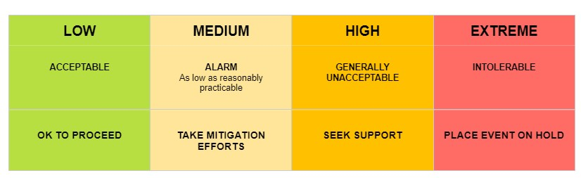

# Introduction
## Risk management involves four major phases: 

**Risk identification:** Identify risks that may affect the project outcome.  
**Risk analysis:** Prioritize risks for subsequent ongoing management based on their likelihood of occurrence and degree of potential impact.  
**Risk response planning:** Develop appropriate options and action plans to reduce the threats of specific risks to project objectives.   
**Risk monitoring and control:** Identifying, analyzing, and planning for newly identified risks, monitoring previously identified risks, and reevaluating existing risks to verify the planned risks response strategies for their effectiveness.  

# Risk Rating Matrix 
**Risk rating key**

## Team Stakeholder Management
A problem with how you do things, a problem from within your team

### Moving Online								Rating: 3
In response to an outbreak of COVID-19 in Victoria, it is possible that Monash returns an online format. This means that all activities and communication will have to be done from home. This could lead to a decrease in output, and difficulties in communication, which can create a risk of not meeting deadlines, or miscommunication/lack of communication occurring.  

**MONITORING:** Await news from the University and keep up to date with announcements from the Premier. For communication and workload monitoring refer to sections below on “Sub-optimal individual contributions”, “Teams have difficulty arranging consistent meetings” and “Insufficient communication from individuals”.

**CONTINGENCY:** In-person meetings will be replaced with Zoom meetings. This includes the three-hour weekly class and team meetings. Ensure that communication channels are well established and clear and there is a greater emphasis on presence and participation in the communication channels - specifically Facebook Messenger which project members should check regularly and provide updates on the state of the project deliverables. Also ensure that each team has an established weekly meeting time for progress check-ins.

### Group Member in Quarantine				Rating: 4
If the team is operating on campus and a member of the group must quarantine/self-isolate and will have to work from home. This will impact the team’s ability to communicate face-to-face and may incur delays from communication barriers. It may also result in other team members being close contacts and having to isolate. If the team is operating in online mode, then this situation still needs to be considered, as we must consider the personal stresses involved with a long term of isolation.

**MONITORING:** Continuous communication both within and between teams. Check up on members in quarantine, discuss their situation and whether they believe they may need a decreased workload. 

**MITIGATION:** Review assigned workloads to ensure they remain realistic and flexible. Establish clear technology choices to enable project members to seamlessly continue to contribute whilst isolated.

**MITIGATION:** The team member(s) in quarantine will decide their potential to contribute to the team. If they can continue contributing, they may be assigned a reduced workload to accommodate their situation. As the team is based entirely on campus, the team will incorporate the affected team member into all in-person sessions via Zoom.

### Loss of a Group Member (Temporary)			Rating: 5
If a group member is temporarily unavailable to contribute to the team, or their capacity to contribute is significantly reduced, there will effectively be a decrease in the number of project members. This may slow down the project's planned progression.

**MONITORING:**
Team members should check-in with their team periodically. Unexplained absences should be recorded in meeting minutes. Team members should also reach out to the project mentors and unit coordinators if they are unable to work for whatever reason, since that way they can help make a plan for them to get back on track.

**MITIGATION:**
Effective mitigation requires teams to ensure that there is no work which can only be readily performed by a single team member. Allowing for a certain amount of ‘slack’ or unallocated time in each increment could allow a temporary loss to be accommodated with minimal disruption. Proper use of the Trello board to precisely record each member's current pending tasks will reduce the time spent on coordinating the schedule recovery effort.

**CONTINGENCY:**
The team members currently assigned tasks must be re-assigned. Until the team member is able to return, their continued absence must be factored in all planning decisions.

### Loss of a Group Member (Permanent)			Rating: 8
If a group member discontinues the unit, or is otherwise permanently no longer part of the project there will be a decrease in the number of project members. This may slow down the project's planned progression.
**MONITORING:** Continuous communication and check-ins with team members so that it can be addressed as early as possible. 

**MITIGATION:** Ensure team members are cross-functional so that tasks can be re-assigned and ensure that work is pushed regularly. During planning and task assignment ensure that no member is doing so much that there is no chance of it being completed without said person. 

**CONTINGENCY:** Re-assign tasks but ensure that the redistributed tasks will not burn the remaining team out. Contact all parties expecting the tasks to be delivered and negotiate the expected due date, as well as inform all parties within the project that may be relying/dependent on your features in order to deliver their tasks on time. Take into account the smaller team size when planning future sprints and if necessary the project manager will re-assess the deliverable features of the final product.

### Team Members Fail to Agree on a Design Choice	Rating: 4
Increased conflict within the team. Decreased likelihood of future input on design decisions.

**MONITORING:** Teams should have regular meetings to discuss design updates and changes. These meetings can be used to identify any areas where team members disagree. 

**MITIGATION:** Ensure that all team members have the opportunity to not just describe their choice, but to justify it and contrast it to the alternative suggestions. 

**CONTINGENCY:** All members of the team will get an input on how to resolve design choice disputes. The option with the most support will be the one selected.

### Sub-Optimal Individual Contributions 			Rating: 6
The end product may be less usable, stable, complete or some combination of these three issues.

**MONITORING:** The contributions of all team members should be reviewed by another team member.

**MITIGATION:** The team will be periodically reminded of the quality expectations and procedures as recorded in the QA plan. Any observed quality issues identified during the review and testing phases should be recorded to assist with performance management. Awareness of this procedure should help to reduce repeat incidents. Testing should be done as often as possible to ensure that code functions as expected.

**CONTINGENCY:** Team members should raise their concerns about the quality of work privately. This should be done as early as possible and should clearly identify any shortcomings. The team member may be asked if they would be interested in further support, such as discussing relevant documentation with a more experienced team member or working in a pair-programming type arrangement for a period of time. If possible, the team member could be re-assigned to contribute to an area of responsibility which is distinct from their current role. An example of this could be moving from an active development role to producing documentation or test cases.

### The Team has Difficulty Arranging Consistent Meetings		Rating: 6
The project schedule may be impacted due to decreased opportunities for clarification, planning and consultation.

**MONITORING:** There should be a minimum number of expected meetings to match the workload being undertaken for a given sprint. Unless the team agrees that fewer meetings are necessary upon starting the increment, they should be mindful if that number of meetings is not met.

**MITIGATION:** Determine the appropriate meeting durations and frequencies. If no time and duration is perfect for the team, encourage a majority of the team to meet when possible. Communicate to the remaining team members clear expectations for how they can contribute and keep the team informed. Detailed minutes should be taken at all meetings and read by team members who are unable to attend.

**CONTINGENCY:** Meetings should be arranged at a time where the majority of team members are able to attend. The meeting time should be changed each week to ensure that the same team members are not continually missing out. Detailed minutes should be taken at each meeting, and those that are unable to attend should read through them.

### Insufficient Communication From Individuals	Rating: 5
A member of the team is not present/responding on communication channels in a timely manner, and reasons for this have not been provided to the rest of the team in advance. The impact this will have on the project increases with the duration of no contact and must be accounted for when devising monitoring and mitigation strategies.

**MONITORING:** Team members are to ensure that if they are expecting to be unable to stay in contact with the team, they inform their team-mates. For unexpected absences it is the responsibility of the rest of the team to try and chase up said member. The entire team is responsible for pre-establishing what is a reasonable minimum response time before mitigation strategies need to take effect. 

**MITIGATION:** After the pre-established time frame has passed for the team member to resume communication, the remaining team is to assume a temporary loss of a group member, see mitigation for “Loss of group member (temporary)” outlined previously. If this persists beyond the second time checkpoint, the team is to assume permanent loss of a group member, see mitigation and contingency for “Loss of group member (permanent)”.

**CONTINGENCY:** After exhausting all communication options, the team will re-assign all the team members pending tasks. Future plans will be made under the assumption that the team member will continue to be absent. If the team member is failing to contribute regularly, it should be raised with the team’s supervisor.

### Technical Debt							Rating: 7
The project may incur technical debt if the team is obliged to make trade-offs to deliver work promptly or if poor design choices are made. The longer these design issues are left unrectified, the greater the eventual time/effort cost to properly fix them will be. This will affect the quality of the project which may ultimately impact the final delivery timeline.

**MONITORING:** The team will ensure that careful consideration is given to architectural decisions with an aim of minimising technical debt when planning the current increment, as well as the next. During the QA process, implemented features should also be reviewed and assessed to ensure that they meet the stated objectives in a way which will not restrict or compromise further development.

**MITIGATION:** Ensure that any potential consequences of technical decisions are recorded and accounted for when making plans. When making decisions which might contribute to technical debt, team members should consider not just the current feature in development but also subsequent features which might also be impacted. A decision which produces the best long-term outcomes is preferred.

**CONTINGENCY:** Inform team, as well as any relevant stakeholders (if necessary), that technical debt will have to be accounted for in the next program increment. Determine all of the potential avenues for resolution and decide collectively which alternative will produce the best outcomes for the project. Inform stakeholders that the next increment may not be as feature heavy as a result of these efforts. 
### Implementation Difficulties					Rating: 7
Difficulties experienced whilst implementing features may negatively impact both the project schedule as well as product quality.

**MONITORING:** Unexpected delays in work or incomplete work should be communicated in the Messenger group.

**MITIGATION:** As each team has several technologically capable members, team members will be encouraged to reach out upon encountering difficulties. In light of the short increments and tight schedules, wasting several days trying to fix an issue will be actively discouraged. To minimise repeated incidents, any resolved issues which may be relevant to other teams should be recorded in a central location, either on the team GitHub or the Google Drive.

**CONTINGENCY:** After the precise issue has been identified, the team will determine if one of their members is positioned to assist. This will be determined by their workload and familiarity with the task requirements. If no member of the team is able to assist, the work may need to be pushed to the next sprint. In this event, the increment schedule must be adjusted to accommodate the delay caused by the implementation difficulty.

### Large Knowledge/Experience Gap Between Members												Rating: 4
A continued skill disparity between team mates may lead to unbalanced workloads and an undue dependence on individual team members. This will impact the ability of the team to meet objectives in the event of illness or burnout.

**MONITORING:** Team members should note the knowledge/experience level demonstrated by team mates during reviews and meetings.

**MITIGATION:** Before each sprint, the team should identify the technologies which will be used by each member during the sprint. If any team members have concerns with the tools they will use, or that others will be expected to use, this should be discussed within the team. The more experienced team members will be encouraged to arrange onboarding sessions with the relevant members. If a team member is required to use a particular technology before the rest of their team, they will be encouraged to keep record of any particularly helpful spikes or resources.

**CONTINGENCY:** If a knowledge gap is persistent and it impacts scheduling or work distribution, team members will share their concerns with their team. Project scheduling may temporarily be adjusted to allow for any unbalanced pairs to work closely together. This pairing will serve as an intensive instruction program intended to close the gap as quickly as possible. If the gap persists after such an arrangement, the possibility of assigning the team member different tasks may be investigated.

### Excessive Time Spent on Documentation Rating: 5
Team members  are required to produce documentation and contribute to deliverables, 
however, it is possible that the time spent on this will result in decreased work output. 

**MONITORING:** All team member should be aware of how much they are contributing to both
the technical aspects  and documentation of the project. If a member has a concern about 
how they are spending their time, they should raise this with the rest of the team.

**MITIGATION:** The amount of time required to complete documentation should be 
considered when planning sprints.This means that all team members will have a 
manageable workload. 

**CONTINGENCY:** If team members are spending too much time on documentation and technical reports, responsibilities should be re-assigned so that the individual has time to work on the main  project. If it is identified as a recurring issue, it should be considered when assigning tasks and in sprint planning. 

### Team Members Not Owning Apple Devices Rating: 7
An Apple device is needed for developing IOS apps using React Native, however, Multiple team members do not own a Mac laptop. 

**MITIGATION** Team members who don't own a Mac should create a  Mac virtual machine. It should be noted that these VMs are very laggy and there will be overhead associated with displaying the app on them. This should be taken into consideration when planning work.

**CONTINGENCY** If team members don't have access to a Mac device, pair programming should be done with members who have one.

## Stakeholder Management
* *A problem with how you interact with stakeholders, a problem with responding to stakeholder requests, a problem setting or meeting external expectations.

## Objectives Are Not Met 			           	Rating: 10
Client confidence and satisfaction may be diminished. Decreased likelihood of meeting subsequent goals.

**MONITORING:** Ensure that progress is regularly reported and recorded through weekly and fortnightly meetings with the client.

**MITIGATION:** Initially plan for a conservative work output per sprint. Gradually adjust this as team capabilities are determined more precisely. Develop benchmarks or milestones within each semester to ensure that progress can be measured in both short and long term.

**CONTINGENCY**: Determine how close the team came to realising their objectives. Re-evaluate the feasibility of both the missed and any future objectives. The team will decide whether to reduce the expected work output in subsequent increments or request additional resources from other teams.

### The Client Insists on a Late Change in Requirements or Functionality								Rating: 8
The team would have to spend time removing and replacing completed work. The impact on the product schedule may be immense.

**MONITORING:** There should be regular communication with the client to show progress and discuss any changes they may want to make. This communication will ideally happen every two weeks.

**MITIGATION:** Clarify client requirements and expectations to the greatest extent possible. Demonstrate work to clients as frequently as is practical to validate the inferred requirements and the related design choices.

**CONTINGENCY:** Have a discussion with the client to determine their priorities and assess the remaining workload to decide whether it is feasible to implement the new functionality. It may come at the expense of being unable to deliver a different requirement. If it is possible to complete the new requirement within the time constraints, the project backlog should be updated to include the new work.

### Disputes Regarding Quality and Scheduling		Rating: 9

**MONITORING:** Communication with the client should be maximised to ensure that they are aware of the current schedule and the team is aware of the client’s expectations for the product. This can be done by organising weekly meetings.

**MITIGATION:** Clients will have a degree of input on both project scheduling and quality expectations. Whilst the client dictates the priority of each feature, the team will decide the exact delivery order. It is important the team provides their rationale for any divergence from the clients preferred schedule. With regards to quality, it is important the team takes every opportunity to demonstrate incremental progress to ascertain the quality expectations of the client.

**CONTINGENCY:** If the client takes issue with the project schedule or quality, a prompt response from the team is critical. This response should justify the delivered quality or intended schedule (as appropriate), whilst offering the client several alternatives to correct the course. Open-ended questions to the client should be avoided. If the client finds none of the options to be acceptable, a meeting with the client should be arranged to work through the problem.

### Failing to meet client functionality expectations Rating: 8

**MONITORING:** Meetings and product demonstrations with the client at the end of every sprint will allow for monitoring client expectations.

**MITIGATION:** After the initial functionality requirements have been gleaned from the client, they should be converted to user stories as quickly as possible. From these stories, mockups of client-facing functionality should be created and presented to the client for feedback. This feedback will be used to re-shape the stories and mockups in a cycle which ends when the client is either satisfied or unavailable.

**CONTINGENCY:** The nature of the deficiency should be identified to the greatest extent allowed by the client. Several alternatives should be prepared or described as quickly as possible and presented to the client. The project managers will alter the roadmap to prioritise the implementation of features the client deems to be the most important.
The circumstances which lead to the misunderstanding should be identified during the team retro to reduce the likelihood of recurrence. This will be done by identifying what did not go well and possible ways to improve.

### App is Not Approved by Chess Governing Body in Time Rating: 8

**MONITORING:** The team has been given a maximum estimated approval time of 4 months. Throughout the year, work should be planned so that the app is submitted for approval before this time.

**MITIGATION:** The team is prioritising requirements from the Chess governing body above requirements from the client. This means that if an incomplete app has to be sent for approval, it will have all of the required features.

**CONTINGENCY:** If this timeframe is unable to be met, it is possible that the application will not be approved before the end of the year. In this event, the application will be submitted for approval when it is fully functional and the team will hear the outcome after the end of the year. The client may need to make any additional changes required internally. 

## Architectural
Computers, servers, internet connection, communications equipment, Operating system, IDE, libraries, third-part code, other systems we rely on

### A Planned Feature is not Achievable Due to an Unforeseen Technical Limitation							Rating: 8
Project may fail to meet its current objectives. Delays may have a cascading effect into future program intervals.

**MONITORING:** Both the team members and the client should be aware of the risks associated with each sprint. Technologies with higher associated risks and uncertainties are more likely to cause unforeseen limitations and their implementation should therefore be monitored carefully.

**MITIGATION:** The feasibility of planned feature additions and the dependencies between features should be evaluated thoroughly before they are added to the schedule. If a novel feature is being developed, an outline of the technical requirements and assumptions should be recorded before work commences. These should be referred to and adjusted as needed throughout the sprint.

**CONTINGENCY:** Alternative approaches to the feature should be identified. The affected team must collectively decide which alternative is the ideal long-term choice for the project. The technical limitation must also be reported to the wider team to ensure that they can mitigate or avoid the limitation in their own work.

### Inappropriate Choices in Third-Party Components													Rating: 9
If an unsuitable framework or library is chosen to meet a particular need, the impact of this choice will increase as the project progresses. This may result in substantial schedule disruptions due to having to remove and replace large portions of the codebase.

**MONITORING:** Perceived shortcomings in third-party components should be recorded as they become apparent.

**MITIGATION:** Third-party components should be chosen based on their capacity to meet both current and future requirements (where available). This capacity must be periodically re-evaluated as requirements solidify and change. This will be primarily achieved through regular spikes.

**CONTINGENCY:** After identifying the most suitable alternative, a decision must be made which balances maximising the amount of salvageable work against any potential future issues. Scheduled changes must be identified at this point and communicated to the relevant stakeholders.

### GitHub Outage							Rating: 4

**MONITORING:** Wide-spread, sustained outages of GitHub will be apparent to all team members, as well as being reported in the tech media.

**Mitigation:** Each team member will have a local copy of the repository and should regularly pull from the main branc so if an outage occurs they can continue working.

**CONTINGENCY:** Team members will ensure the integrity of the GitLab backup repository by comparing it to their own local copy. If valid, the team may continue to use GitLab for the duration of the GitHub outage. As no team rules or policies are dependent on specific GitHub functionality, this change should be reasonably seamless.

